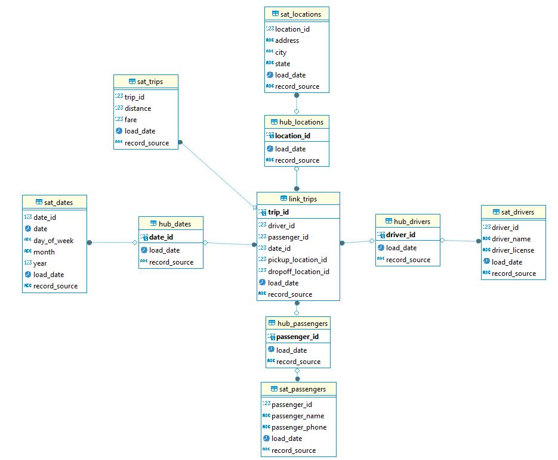

# model-data-vault
Создание модели данных Data Vault для анализа данных о поездках в такси

## Hubs (Хабы)
hub_drivers - водители <br>
hub_passengers - пассажиры <br>
hub_dates - даты <br>
hub_locations - локации <br>

## Links (Линки)
link_trips - поездки <br>

## Satellites (Спутники)
sat_drivers - водители <br>
sat_passengers - пассажиры <br>
sat_dates - даты <br>
sat_locations - локации <br>
sat_trips - поездки <br>

## Поля

### hub_drivers (хаб водителей)
driver_id – Идентификатор водителя <br>
load_date – Дата загрузки <br>
record_source – Источник записи <br>

### hub_passengers (хаб пассажиров)
passenger_id – Идентификатор пассажира <br>
load_date – Дата загрузки <br>
record_source – Источник записи <br>

### hub_dates (хаб дат)
date_id – Идентификатор даты <br>
load_date – Дата загрузки <br>
record_source – Источник записи <br>

### hub_locations (хаб местоположений)
location_id – Идентификатор местоположения <br>
load_date – Дата загрузки <br>
record_source – Источник записи <br>

### link_trips (ссылка поездок)
trip_id – Идентификатор поездки <br>
driver_id – Идентификатор водителя <br>
passenger_id – Идентификатор пассажира <br>
date_id – Идентификатор даты <br>
pickup_location_id – Идентификатор места посадки <br>
dropoff_location_id – Идентификатор места высадки <br>
load_date – Дата загрузки <br>
record_source – Источник записи <br>

### sat_drivers (спутник водителей)
driver_id – Идентификатор водителя <br>
driver_name – Имя водителя <br>
driver_license – Номер водительского удостоверения <br>
load_date – Дата загрузки <br>
record_source – Источник записи <br>

### sat_passengers (спутник пассажиров)
passenger_id – Идентификатор пассажира <br>
passenger_name – Имя пассажира <br>
passenger_phone – Телефон пассажира <br>
load_date – Дата загрузки <br>
record_source – Источник записи <br>

### sat_dates (спутник дат)
date_id – Идентификатор даты <br>
date – Дата <br>
day_of_week – День недели <br>
month – Месяц <br>
year – Год <br>
load_date – Дата загрузки <br>
record_source – Источник записи <br>

### sat_locations (спутник местоположений)
location_id – Идентификатор местоположения <br>
address – Адрес <br>
city – Город <br>
state – Штат/область <br>
load_date – Дата загрузки <br>
record_source – Источник записи <br>

### sat_trips (спутник поездок)
trip_id – Идентификатор поездки <br>
distance – Расстояние <br>
fare – Стоимость проезда <br>
load_date – Дата загрузки <br>
record_source – Источник записи <br>

## Схема


## SQL-скрипт
```
CREATE SCHEMA IF NOT EXISTS data_vault;

CREATE TABLE data_vault.hub_drivers (
    driver_id INT PRIMARY KEY,
    load_date DATE,
    record_source VARCHAR(50)
);

CREATE TABLE data_vault.hub_passengers (
    passenger_id INT PRIMARY KEY,
    load_date DATE,
    record_source VARCHAR(50)
);

CREATE TABLE data_vault.hub_dates (
    date_id INT PRIMARY KEY,
    load_date DATE,
    record_source VARCHAR(50)
);

CREATE TABLE data_vault.hub_locations (
    location_id INT PRIMARY KEY,
    load_date DATE,
    record_source VARCHAR(50)
);

CREATE TABLE data_vault.link_trips (
    trip_id INT PRIMARY KEY,
    driver_id INT,
    passenger_id INT,
    date_id INT,
    pickup_location_id INT,
    dropoff_location_id INT,
    load_date DATE,
    record_source VARCHAR(50),
    FOREIGN KEY (driver_id) REFERENCES data_vault.hub_drivers(driver_id),
    FOREIGN KEY (passenger_id) REFERENCES data_vault.hub_passengers(passenger_id),
    FOREIGN KEY (date_id) REFERENCES data_vault.hub_dates(date_id),
    FOREIGN KEY (pickup_location_id) REFERENCES data_vault.hub_locations(location_id),
    FOREIGN KEY (dropoff_location_id) REFERENCES data_vault.hub_locations(location_id)
);

CREATE TABLE data_vault.sat_drivers (
    driver_id INT,
    driver_name VARCHAR(100),
    driver_license VARCHAR(50),
    load_date DATE,
    record_source VARCHAR(50),
    FOREIGN KEY (driver_id) REFERENCES data_vault.hub_drivers(driver_id)
);

CREATE TABLE data_vault.sat_passengers (
    passenger_id INT,
    passenger_name VARCHAR(100),
    passenger_phone VARCHAR(20),
    load_date DATE,
    record_source VARCHAR(50),
    FOREIGN KEY (passenger_id) REFERENCES data_vault.hub_passengers(passenger_id)
);

CREATE TABLE data_vault.sat_dates (
    date_id INT,
    date DATE,
    day_of_week VARCHAR(10),
    month VARCHAR(10),
    year INT,
    load_date DATE,
    record_source VARCHAR(50),
    FOREIGN KEY (date_id) REFERENCES data_vault.hub_dates(date_id)
);

CREATE TABLE data_vault.sat_locations (
    location_id INT,
    address VARCHAR(255),
    city VARCHAR(100),
    state VARCHAR(100),
    load_date DATE,
    record_source VARCHAR(50),
    FOREIGN KEY (location_id) REFERENCES data_vault.hub_locations(location_id)
);

CREATE TABLE data_vault.sat_trips (
    trip_id INT,
    distance DECIMAL(10, 2),
    fare DECIMAL(10, 2),
    load_date DATE,
    record_source VARCHAR(50),
    FOREIGN KEY (trip_id) REFERENCES data_vault.link_trips(trip_id)
);
```
